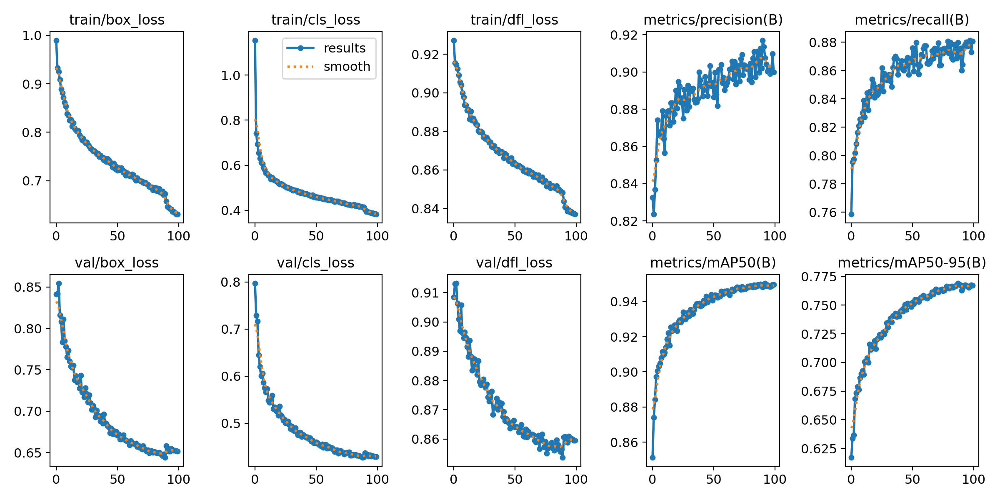
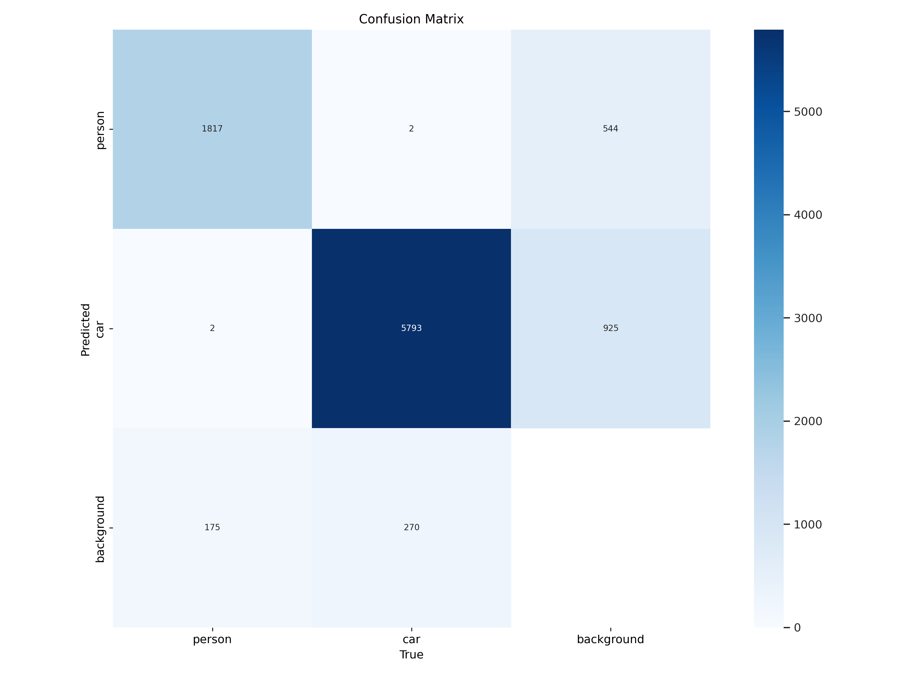
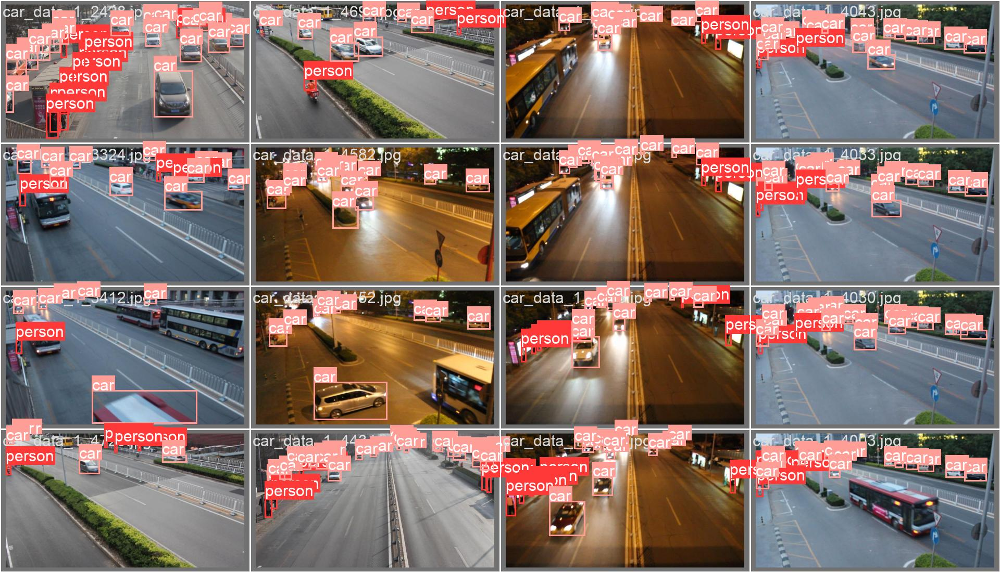
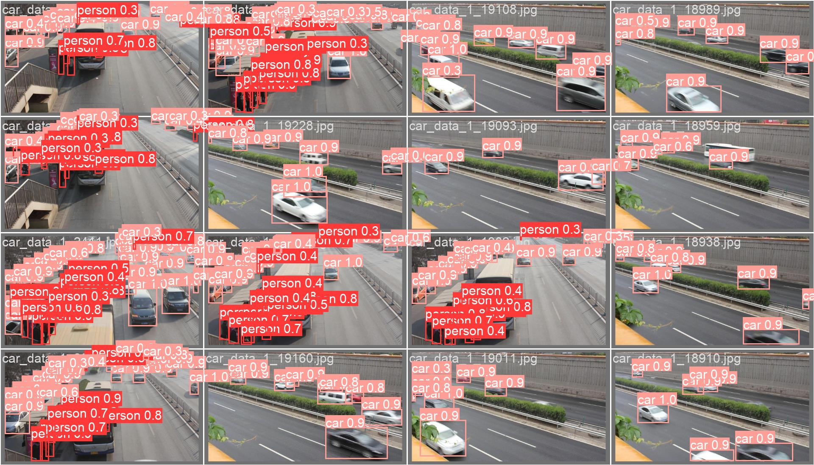

# YOLOv8 人车目标检测系统

  


基于 YOLOv8 和 Faster R-CNN 的人车目标检测系统，集成 Streamlit Web 界面，支持图片上传检测、视频检测和实时摄像头检测，并提供多模型性能对比分析。

## 痛点与目的

- **问题**：城市道路和交叉路口的行人与车辆监控，传统方案依赖人工看视频回放，效率低且无法实时响应异常事件
- **方案**：用 YOLOv8 和 Faster R-CNN 两种主流检测模型做人车检测，通过 Streamlit 搭建 Web 交互界面，在浏览器中直接上传图片/视频或接入摄像头检测
- **效果**：两种模型的 AP、Recall、Precision、F1 评估结果可直接对比，方便选型

## 核心功能

- **Streamlit Web 界面**：基于浏览器的可视化检测平台，操作简便
- **YOLOv8 目标检测**：使用 YOLOv8 实现高速人车检测
- **Faster R-CNN 对比**：提供 Faster R-CNN 模型的训练与评估结果
- **多模式检测**：支持图片上传、视频文件和摄像头实时检测
- **置信度调节**：可调整检测阈值控制检测灵敏度
- **性能评估**：提供 AP、Recall、Precision、F1 等完整评估指标

## 使用说明

### 环境安装

```bash
pip install streamlit ultralytics
```

### 启动 Web 检测界面

```bash
cd 1005/yolov8_qianduan
streamlit run app.py
```

## 项目结构

```
.
└── 1005/
    ├── yolov8_qianduan/          # YOLOv8 检测前端
    │   ├── app.py                # Streamlit 主程序
    │   ├── config.py             # 模型配置
    │   ├── utils.py              # 工具函数
    │   ├── weights/              # 模型权重
    │   ├── renche/               # 人车数据集（train/test/val）
    │   ├── train/                # 训练脚本与配置
    │   └── requirements.txt      # 依赖列表
    └── frcnn/                    # Faster R-CNN 对比实验
        ├── results/              # 评估结果（AP/Recall/Precision/F1）
        └── logs/                 # 训练日志
```

## 实验结果

### 训练指标曲线



### 混淆矩阵



### 验证集标注



### 验证集预测效果



## 适用场景

- 智能交通监控与分析
- 自动驾驶辅助感知
- 城市安防视频分析
- 目标检测模型对比研究

## 技术栈

| 组件 | 技术 |
|------|------|
| 目标检测 | YOLOv8, Faster R-CNN |
| Web 界面 | Streamlit |
| 深度学习 | PyTorch, ultralytics |
| 图像处理 | OpenCV, Pillow |

## 许可证

MIT 许可证
